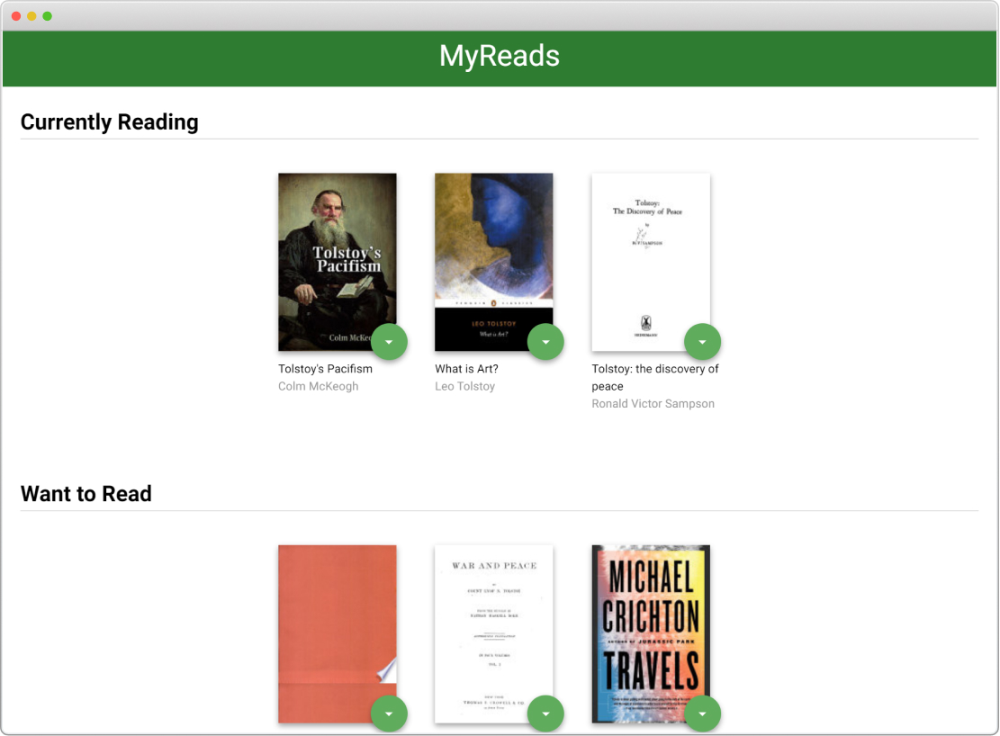

# MyReads

Booklist app created with React.js

## General info

This simple booklist app lets users search books and add to their bookshelves. There are three bookshelves which are Currently Reading, Want to Read, and Read. Books can be moved easily to different bookshelves according to users' needs.

## Setup

To run this project:

- install all project dependencies with `npm install`
- start the development server with `npm start`
